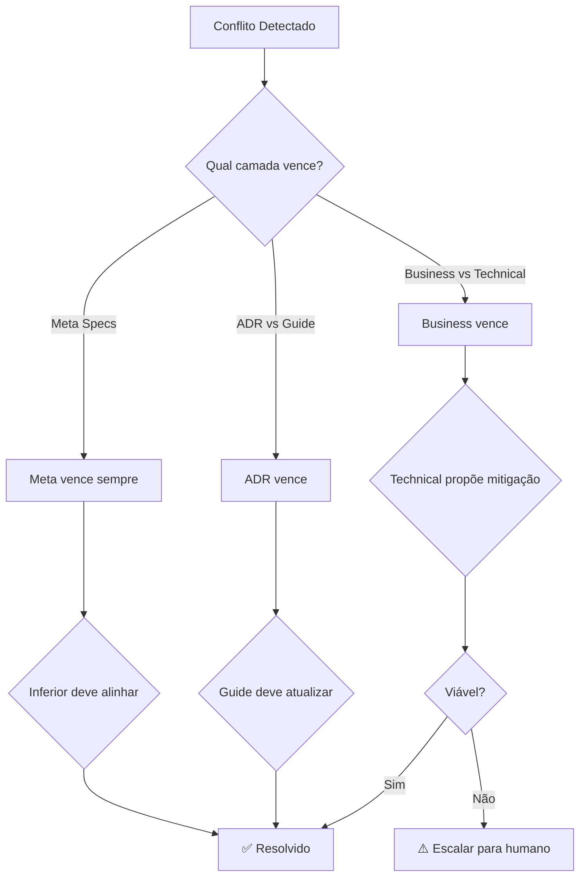

# Hierarquia de Contexto - Crypteras

:::version_info
**Versão**: 1.0.0
**Válida desde**: 2025-12-25
**Status**: Active
:::

Este documento define a **hierarquia de precedência** entre diferentes camadas de especificações no Crypteras Trading System.

> **Regra de Ouro**: Em caso de conflito, a camada superior SEMPRE vence.

---

## 📊 Camadas de Contexto (Maior → Menor Precedência)

### Camada 1: Meta Specs ⚡
**Path**: `specs/_meta/`
**Precedência**: **MÁXIMA**
**Propósito**: Governança, versionamento, hierarquia, políticas

**Características**:
- Define COMO todas as outras specs funcionam
- Políticas de versionamento
- Regras de governança
- Anti-patterns e boas práticas

**Arquivos-chave**:
- [CONTEXT_HIERARCHY.md](./CONTEXT_HIERARCHY.md) - Este arquivo
- [VERSIONING_POLICY.md](./VERSIONING_POLICY.md) - Política de versionamento
- [VERSION_HISTORY.md](./VERSION_HISTORY.md) - Histórico de versões
- [ANTI_PATTERNS.md](./ANTI_PATTERNS.md) - Anti-patterns em desenvolvimento com IA
- [GOVERNANCE_SUMMARY.md](./GOVERNANCE_SUMMARY.md) - Resumo de governança

**Regra de Precedência**:
```
Meta Specs > Todas as outras specs
```

**Exemplo de Uso**:
- Meta spec diz: "Toda spec DEVE ter spec_version"
- Qualquer spec sem versão: VIOLAÇÃO (deve ser corrigida)

---

### Camada 2: Business Specs 💼
**Path**: `specs/business/`
**Precedência**: **ALTA**
**Propósito**: Contexto de negócio, produto, clientes, estratégia

**Características**:
- Define O QUE construir (requisitos, features)
- Personas de clientes
- Estratégia de produto
- Jornadas do cliente
- Planos de assinatura

**Arquivos-chave**:
- [index.md](../business/index.md) - Índice de specs business
- [PRODUCT_STRATEGY.md](../business/PRODUCT_STRATEGY.md) - Estratégia de produto
- [CUSTOMER_PERSONAS.md](../business/CUSTOMER_PERSONAS.md) - Personas
- [features/](../business/features/) - Features de negócio

**Regra de Precedência**:
```
Business Specs > Technical Specs
Business Specs < Meta Specs
```

**Exemplo de Uso**:
- Business spec diz: "Feature de Grid Trading é prioridade"
- Technical spec diz: "Grid Trading não é viável"
- Resolução: Business vence → Technical deve propor mitigação ou workaround

---

### Camada 3: Technical Specs 🔧
**Path**: `specs/technical/`
**Precedência**: **MÉDIA**
**Propósito**: Arquitetura, código, implementação, stack técnico

**Características**:
- Define COMO construir (arquitetura, padrões)
- ADRs (Architecture Decision Records)
- Guias de código
- Especificações de API

**Arquivos-chave**:
- [index.md](../technical/index.md) - Índice de specs técnicas
- [CLAUDE.meta.md](../technical/CLAUDE.meta.md) - Boas práticas de código
- [CODEBASE_GUIDE.md](../technical/CODEBASE_GUIDE.md) - Guia do codebase
- [adr/](../technical/adr/) - Architecture Decision Records

**Regra de Precedência**:
```
Technical Specs > Execution Context
Technical Specs < Business Specs
Technical Specs < Meta Specs
```

**Subcamadas Técnicas**:
1. **ADRs** (maior precedência técnica): Decisões arquiteturais
2. **Guides** (menor precedência técnica): Orientações e boas práticas

**Regra Interna**:
```
ADRs > Guides
```

**Exemplo de Uso**:
- ADR-001 diz: "Usar Vue 3 Composition API"
- CLAUDE.meta.md deve alinhar: "Sempre usar Composition API (ADR-001)"

---

### Camada 4: Execution Context 📝
**Path**: `.claude/sessions/`
**Precedência**: **MÍNIMA**
**Propósito**: Contexto volátil de sessão específica

**Características**:
- Contexto temporário
- Específico de uma task/PR
- Não versionado (efêmero)
- Descartável após conclusão

**Arquivos**:
- `.claude/sessions/{SESSION_ID}/context.md`
- `.claude/sessions/{SESSION_ID}/architecture.md`

**Regra de Precedência**:
```
Execution Context < Todas as specs versionadas
```

**Exemplo de Uso**:
- Execution context diz: "Para esta task, usar X"
- Business spec diz: "Feature Y requer Z"
- Resolução: Business vence → Execution context deve alinhar

---

## 🔀 Resolução de Conflitos

### Matriz de Precedência

| Conflito | Camada Superior | Camada Inferior | Vencedor |
|----------|----------------|-----------------|----------|
| Meta vs Business | Meta Specs | Business Specs | **Meta** |
| Meta vs Technical | Meta Specs | Technical Specs | **Meta** |
| Business vs Technical | Business Specs | Technical Specs | **Business** |
| ADR vs Guide | ADR | Guide (mesmo técnico) | **ADR** |
| Spec vs Execution | Qualquer Spec | Execution Context | **Spec** |

### Fluxo de Resolução



---

## 📋 Exemplos de Conflitos e Resoluções

### Exemplo 1: Meta vs Business (Versionamento)

**Conflito**:
```yaml
# Meta Spec (VERSIONING_POLICY.md)
Regra: "Toda spec DEVE ter spec_version no frontmatter"

# Business Spec (VOICE_OF_CUSTOMER.md)
Frontmatter: (sem spec_version)
```

**Precedência**: Meta > Business

**Resolução**:
1. ✅ Meta spec vence (precedência máxima)
2. 🛑 Business spec está em VIOLAÇÃO
3. 📋 Ação obrigatória: Adicionar spec_version a VOICE_OF_CUSTOMER.md
4. 🚫 Bloquear uso até conformidade

**Comando de Correção**:
```bash
/add-versioning business
```

---

### Exemplo 2: Business vs Technical (Feature Viabilidade)

**Conflito**:
```yaml
# Business Spec (PRODUCT_STRATEGY.md v2.0.0)
Requisito: "OAuth com Google/GitHub é prioridade Q1"

# Technical Spec (features/authentication.md v1.0.0)
Limitação: "OAuth não está no escopo do MVP atual"
```

**Precedência**: Business > Technical

**Resolução Correta** ✅:
1. Business spec vence (requisito mantido)
2. Technical spec DEVE propor mitigação:
   - Opção 1: Implementar OAuth em Q1 (ajustar roadmap técnico)
   - Opção 2: Propor timeline alternativo (Q2) + justificativa
   - Opção 3: Implementação parcial (Google only) em Q1
3. Documentar mitigação escolhida em technical spec
4. Se impossível: Escalar para Product Owner (não bloqueável por tech)

**Resolução Incorreta** ❌:
- ❌ Technical spec simplesmente ignora requisito business
- ❌ Business spec é alterada sem aprovação do PO
- ❌ Conflito não é documentado

**Documentação da Resolução**:
```markdown
# specs/technical/features/authentication.md

:::intent
**Business Requirement**: OAuth com Google/GitHub (PRODUCT_STRATEGY.md v2.0.0)

**Technical Constraint**: OAuth requer biblioteca adicional e configuração OAuth app

**Resolution**:
- ✅ Implementar Google OAuth em Q1 (prioridade confirmada)
- ⏳ GitHub OAuth em Q2 (menor demanda inicial)
- 📋 Roadmap atualizado

**Trade-offs**:
- Pro: Atende 80% dos usuários (Google mais popular)
- Con: Atraso de 1 sprint no roadmap original
:::
```

---

### Exemplo 3: ADR vs Guide (Padrão de Código)

**Conflito**:
```yaml
# ADR (adr/001-vue3-composition-api.md v1.0.0)
Decisão: "100% Vue 3 Composition API - sem Options API"

# Guide (CLAUDE.meta.md v1.2.0)
Orientação: "Aceitar Options API em componentes legacy"
```

**Precedência**: ADR > Guide (dentro da camada técnica)

**Resolução**:
1. ADR vence (decisões arquiteturais > guidelines)
2. CLAUDE.meta.md DEVE alinhar com ADR-001
3. Opções:
   - Atualizar CLAUDE.meta.md para reforçar ADR
   - Se exceção é válida: Criar ADR-001.1 documentando exceção
   - Migrar componentes legacy para Composition API

**Correção de CLAUDE.meta.md**:
```markdown
# CLAUDE.meta.md

## Vue 3 Composition API

**Padrão Obrigatório**: Composition API (ADR-001 v1.0.0)

**Regra**: 100% Composition API - sem Options API

**Exceções**: NENHUMA (conforme ADR-001)

**Componentes Legacy**: Devem ser migrados progressivamente
```

---

### Exemplo 4: Meta vs Technical (Anti-Pattern)

**Conflito**:
```yaml
# Meta Spec (ANTI_PATTERNS.md v1.0.0)
Anti-Pattern: "Prompt-Only Development - sempre usar specs versionadas"

# Technical Spec (implementação sem spec)
Código gerado: Via prompt direto, sem spec referenciada
```

**Precedência**: Meta > Technical

**Resolução**:
1. Meta spec vence (anti-pattern definido)
2. Código gerado via prompt-only está em VIOLAÇÃO
3. Ação obrigatória:
   - Criar spec adequada (business ou technical)
   - Versionar spec
   - Adicionar Intent as Code
   - Referenciar spec no código gerado

**Bloqueio**:
```markdown
🛑 VIOLAÇÃO DE META SPEC DETECTADA

**Anti-Pattern**: Prompt-Only Development (ANTI_PATTERNS.md v1.0.0 #1)

**Problema**: Código gerado sem spec versionada

**Ação Obrigatória**:
1. Criar spec em specs/business/features/ ou specs/technical/
2. Adicionar versionamento: /add-versioning
3. Adicionar intent: /add-intent
4. Referenciar spec no código

**Não pode prosseguir até resolver** 🚫
```

---

## 🚫 Referências Entre Camadas: Regras

### Regras de Referência

**PERMITIDO** ✅:
- Camada inferior referencia camada superior
  - Technical spec → Business spec ✅
  - Business spec → Meta spec ✅
  - Execution context → Qualquer spec ✅
- Mesma camada referencia mesma camada
  - Business spec → Business spec ✅
  - Technical spec → Technical spec ✅

**PROIBIDO** ❌:
- Camada superior referencia camada inferior
  - Meta spec → Business spec ❌
  - Meta spec → Technical spec ❌
  - Business spec → Technical spec ❌

### Por que essa regra?

**Dependência unidirecional** (inferior → superior):
- Evita dependências circulares
- Meta specs são estáveis (não mudam frequentemente)
- Business specs mudam mais que Meta
- Technical specs mudam mais que Business
- Mudança em superior não quebra inferior

**Exemplo Correto** ✅:
```markdown
# specs/technical/CLAUDE.meta.md

:::intent
**Source**: specs/business/PRODUCT_STRATEGY.md v2.0.0
**Requisito**: Código deve alinhar com estratégia de produto
:::

(Technical referencia Business - VÁLIDO)
```

**Exemplo Incorreto** ❌:
```markdown
# specs/_meta/CONTEXT_HIERARCHY.md

:::example
Veja specs/technical/CLAUDE.meta.md para exemplo de boas práticas
:::

(Meta referencia Technical - INVÁLIDO)
```

**Correção**:
```markdown
# specs/_meta/CONTEXT_HIERARCHY.md

:::example
Technical specs devem seguir padrões de código definidos em ADRs
:::

(Exemplo genérico, sem referência específica - VÁLIDO)
```

---

## 🔍 Validação de Hierarquia

### Comando de Validação

```bash
/validate-hierarchy
```

**O que valida**:
1. ✅ CONTEXT_HIERARCHY.md existe e está completo
2. ✅ Estrutura de diretórios alinhada com camadas
3. ✅ Conflitos entre camadas resolvidos corretamente
4. ✅ ADRs têm precedência sobre Guides
5. ✅ Referências respeitam regras (inferior → superior)

### Checklist de Conformidade

**Estrutura** (obrigatório):
- [ ] specs/_meta/ existe (Camada 1)
- [ ] specs/business/ existe (Camada 2)
- [ ] specs/technical/ existe (Camada 3)
- [ ] specs/technical/adr/ existe (subcamada ADRs)

**Documentação** (obrigatório):
- [ ] CONTEXT_HIERARCHY.md existe e está completo
- [ ] Define 4 camadas claramente
- [ ] Exemplos de resolução de conflitos presentes

**Conformidade** (validação contínua):
- [ ] Sem conflitos não resolvidos entre camadas
- [ ] ADRs sempre vencem Guides
- [ ] Referências seguem regra (inferior → superior)
- [ ] Meta specs não referenciam Business/Technical

---

## 📊 Diagrama de Hierarquia

```
┌─────────────────────────────────────────┐
│   Camada 1: Meta Specs (specs/_meta/)   │ ← Precedência MÁXIMA
│   - Governança                          │
│   - Versionamento                       │
│   - Anti-patterns                       │
└─────────────────────────────────────────┘
              ↑ (pode referenciar)
              │
┌─────────────────────────────────────────┐
│ Camada 2: Business (specs/business/)    │ ← Precedência ALTA
│   - Estratégia de produto               │
│   - Personas                            │
│   - Features de negócio                 │
└─────────────────────────────────────────┘
              ↑ (pode referenciar)
              │
┌─────────────────────────────────────────┐
│ Camada 3: Technical (specs/technical/)  │ ← Precedência MÉDIA
│   ├── ADRs (decisões arquiteturais)     │ ← Maior precedência técnica
│   └── Guides (orientações)              │ ← Menor precedência técnica
└─────────────────────────────────────────┘
              ↑ (pode referenciar)
              │
┌─────────────────────────────────────────┐
│ Camada 4: Execution (.claude/sessions/) │ ← Precedência MÍNIMA
│   - Contexto volátil                    │
│   - Específico de task                  │
└─────────────────────────────────────────┘
```

**Fluxo de Referências** (sempre de baixo para cima):
```
Execution → Technical → Business → Meta
   ✅          ✅          ✅        ✅
```

**Fluxo de Precedência** (conflitos resolvidos de cima para baixo):
```
Meta → Business → Technical → Execution
 🏆      🥈         🥉          4º
```

---

## 🎯 Benefícios de Hierarquia Clara

### Para Desenvolvedores
- ✅ **Clareza**: Sabe qual spec seguir em conflitos
- ✅ **Rapidez**: Resolução de conflitos é automática
- ✅ **Confiança**: Decisões têm base clara

### Para IA
- ✅ **Determinístico**: Sempre sabe qual spec vence
- ✅ **Rastreável**: Pode explicar por que seguiu spec X
- ✅ **Consistente**: Decisões alinhadas com hierarquia

### Para o Projeto
- ✅ **Governança**: Meta specs controlam tudo
- ✅ **Estabilidade**: Mudanças em cascade (superior → inferior)
- ✅ **Manutenibilidade**: Fácil evoluir specs sem conflitos

---

## 🔄 Manutenção

### Quando Atualizar Este Documento

1. **Nova camada criada**: Atualizar hierarquia
2. **Regra de precedência muda**: Documentar breaking change
3. **Novo tipo de conflito**: Adicionar exemplo de resolução
4. **Feedback do time**: Incorporar aprendizados

### Versionamento

- **MAJOR**: Mudança na ordem de precedência (ex: Business > Meta)
- **MINOR**: Nova camada adicionada
- **PATCH**: Exemplos/clarificações

---

## 📚 Referências

- [VERSIONING_POLICY.md](./VERSIONING_POLICY.md) - Política de versionamento
- [ANTI_PATTERNS.md](./ANTI_PATTERNS.md) - Anti-patterns
- [GOVERNANCE_SUMMARY.md](./GOVERNANCE_SUMMARY.md) - Resumo de governança

---

:::metadata
**Criado**: 2025-12-25
**Autor**: Crypteras Team
**Revisores**: Tech Lead, Product Owner
**Próxima Revisão**: 2026-03-25
:::
